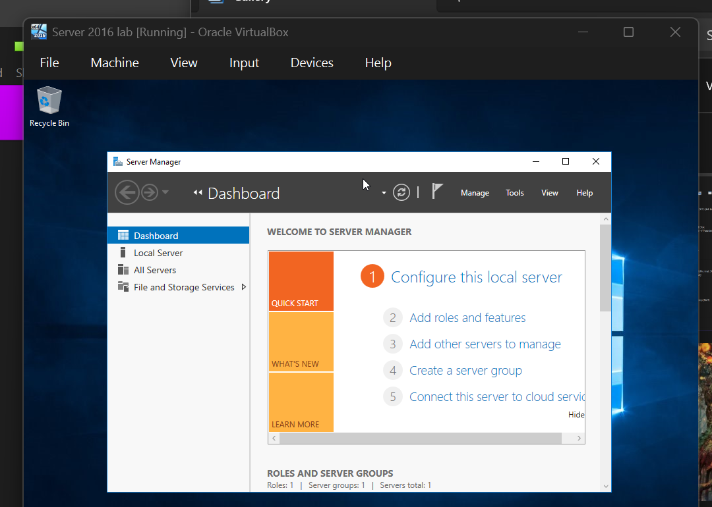
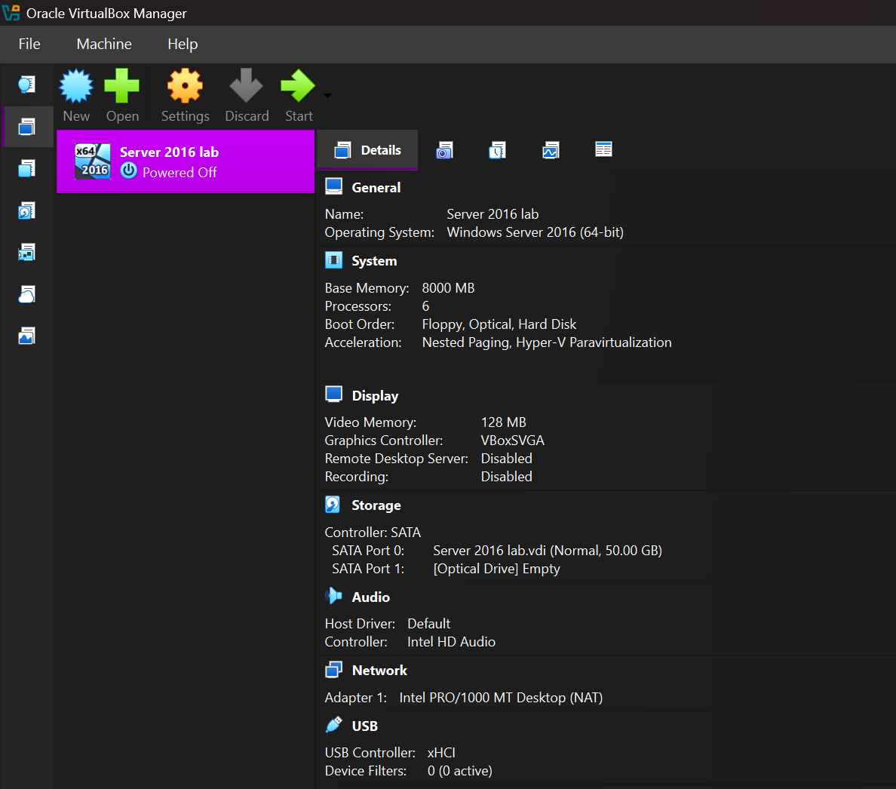

# Lab 01: Windows Server 2019 Installation

**Date**: August 16, 2025

### 🎯 Objective
Install Windows Server 2016 in a virtual environment using VirtualBox.

---

### 🛠️ Steps Taken

1. Downloaded the Windows Server 2016 ISO from Microsoft's Evaluation Center.
2. Created a new virtual machine:
   - 8 GB RAM  
   - 50 GB disk  
   - 6 CPU  
3. Mounted ISO and booted VM.
4. Completed Windows setup:
   - Selected Desktop Experience
   - Set Administrator password
5. Verified basic functionality:
   - Logged in
   - Checked IP settings
   - Installed updates

---

### 🧠 What I Learned

- Difference between Server Core and Desktop Experience.
- Minimum system requirements for Windows Server.
- How to create a VM with correct settings for performance and compatibility.

---

### ⚠️ Issues Faced

- Had problems with mounting ISO and booting VM → Fixed by installing missing microsoft visual
  C++ redistributable .exe file.
  
---

### 🖼️ Screenshot# Lab 01: Windows Server 2019 Installation
 

