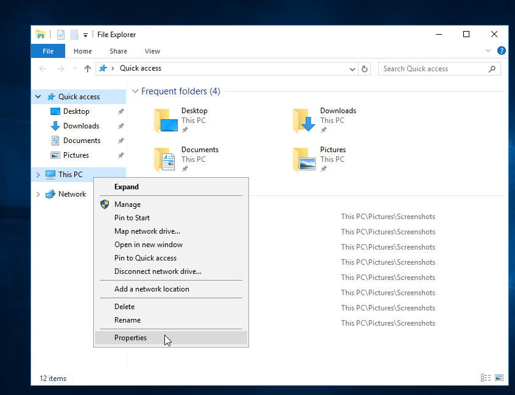
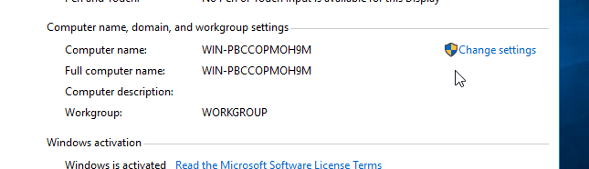
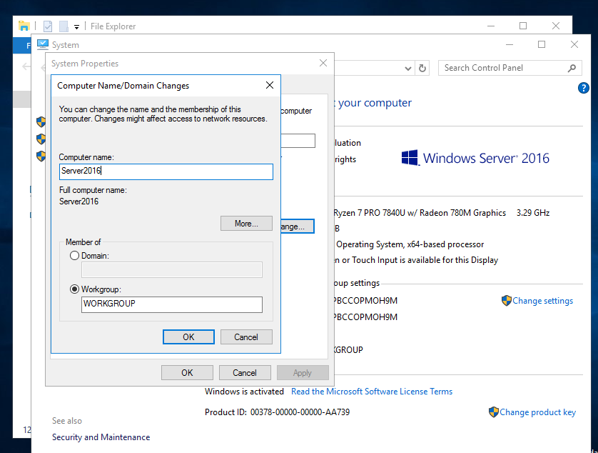
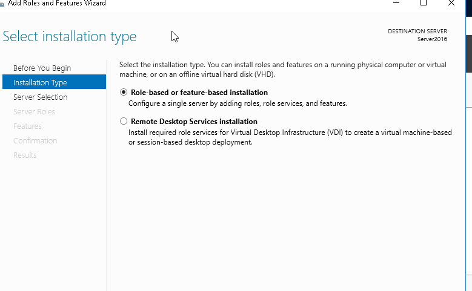
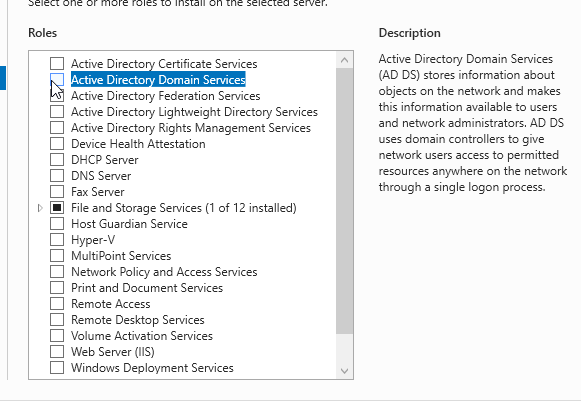
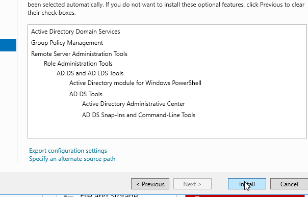
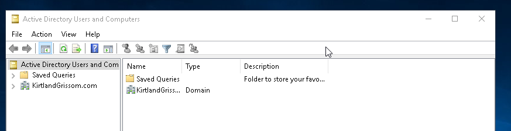

# Lab 02: Rename Windows Server 2016 + Install Active Directory

**Date**: August 16, 2025

-------

### 🎯 Objective

- Rename the Windows Server to a recognizable hostname.
- Install and configure Active Directory Domain Services (AD DS) and promote the server to a Domain Controller.

-------

### 🛠️ Steps Taken

#### 1. Renamed the Server:
- Changed computer name to `Server2016` for more readability
- Restarted server to apply the name change

#### 2. Installed Active Directory Domain Services:

- Opened Server Manager
- Clicked "Add roles and features"
- Selected Active Directory Domain Services (AD DS)
- Completed installation

 #### 3. Promoted Server to a Domain

 - After AD DS was installed, clicked "Promote this server to a domain controller" 
 - Selected "Add a new forest"
 - Domain name: KirtlandGrissom.com
 - Set DSRM (Directory Services Restore Mode) password
 - Restarted server after promotion

### 🖼️ Screenshot

Server renamed successfully:
   

AD DS promotion to domain controller:
 
 
 

### 🧠 What I Learned

 - Renaming the server before AD setup prevents replication or identity issues.
 - Domain Controllers must have static IPs and DNS set to themselves.
 - AD setup adds DNS and other necessary services.
