# Lab 03: Active Directory Account Creation & Common CMD Commands  

**Date**: 8/18/2025  

---

### 🎯 Objective  
- Create and manage Active Directory user accounts.  
- Learn to use the **copy method** for faster account creation.  
- Configure a static IP address.  
- Practice essential command-line tools for user and network management.  

---

### 🛠️ Steps Taken  

- Opened **Server Manager Dashboard** → **Tools** → **Active Directory Users and Computers**.  

- Created a new user by right-clicking **Users** → **New** → **User**, then filling out required details.  

- Located users with the **Find** option and expanded searches using **Advanced Features** to view object paths.  

- Used the **Copy User** feature (from Administrator) to create accounts with preconfigured settings.  

- Configured a **Static IP Address** via Control Panel → Network Settings → IPv4 properties.  

---

### 🖼️ Screenshot  

## Add user to AD 

## Adding user with advance features
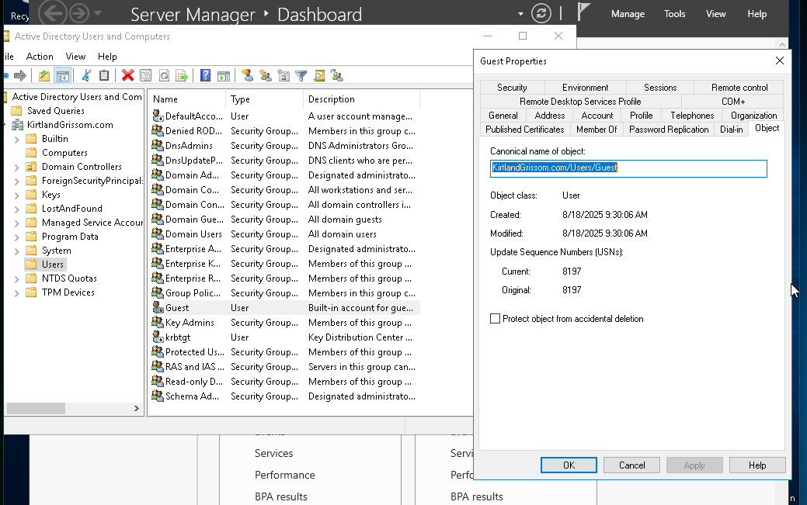

## Copying user in AD
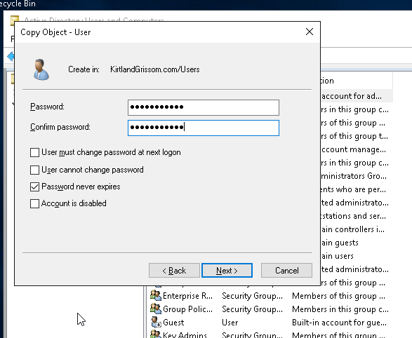
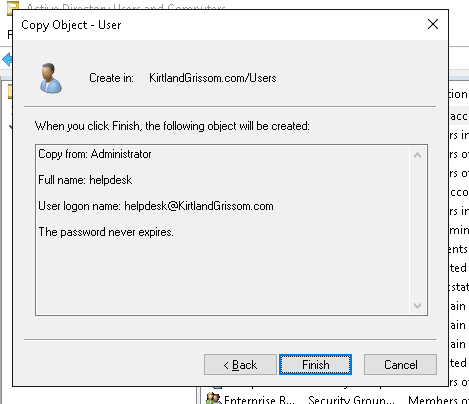
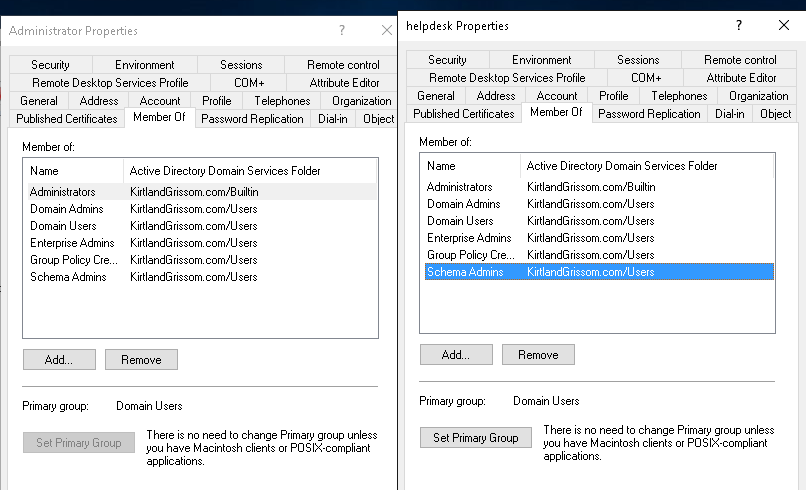

## Enabling recycle bi
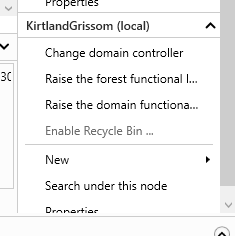

## setting up static IP address
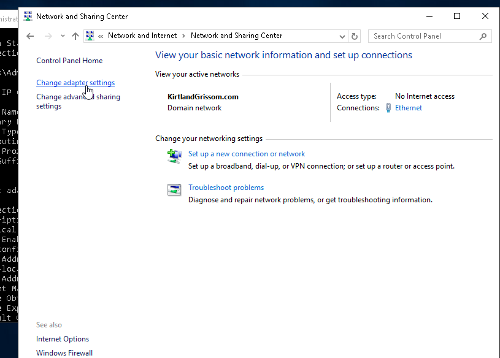
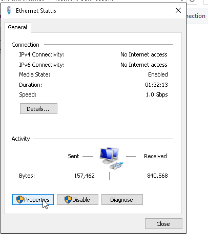
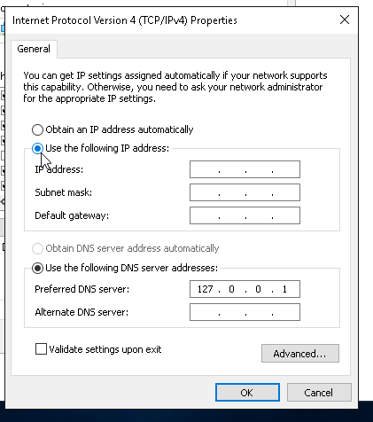

### CMD commands

## Ipconfig all

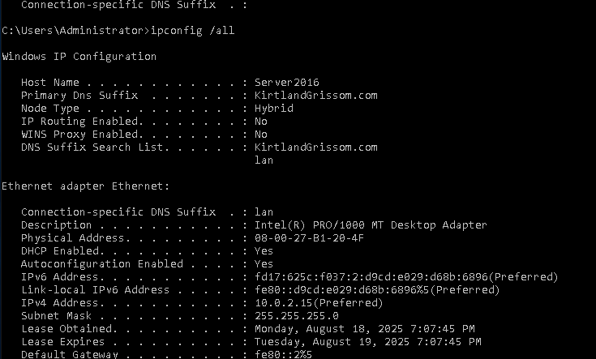

## Ipconfig

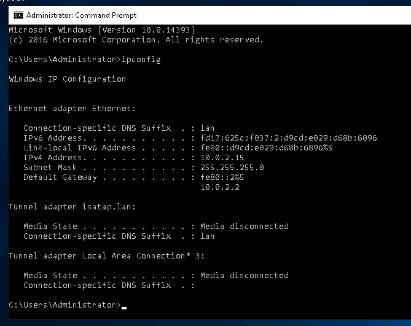

## net use

## net user

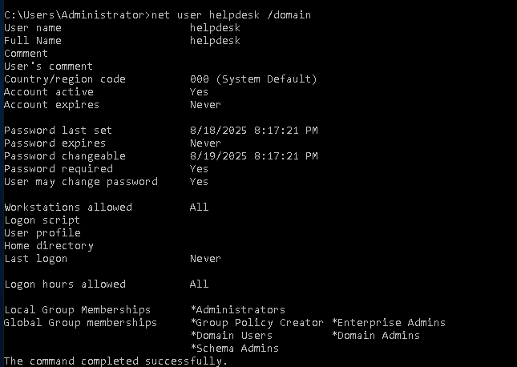

---

### 🧠 What I Learned  

- **Active Directory**  
  - How to create user accounts manually and with the copy method.  
  - Using **Advanced Features** to view object paths and gain more control.  
  - Enabling the **Recycle Bin** for recovery of deleted AD objects.  

- **Networking**  
  - Why static IP addresses are useful for devices like printers (to avoid DHCP reassignment issues).  

- **Command-Line Tools**  
  - `ipconfig` → View current TCP/IP configuration.  
  - `ipconfig /all` → View full details including DHCP server info.  
  - `net use` → Display mapped/shared drives.  
  - `net user <domain\username> /domain` → Check account details (password policies, group membership, expiration).  

---

